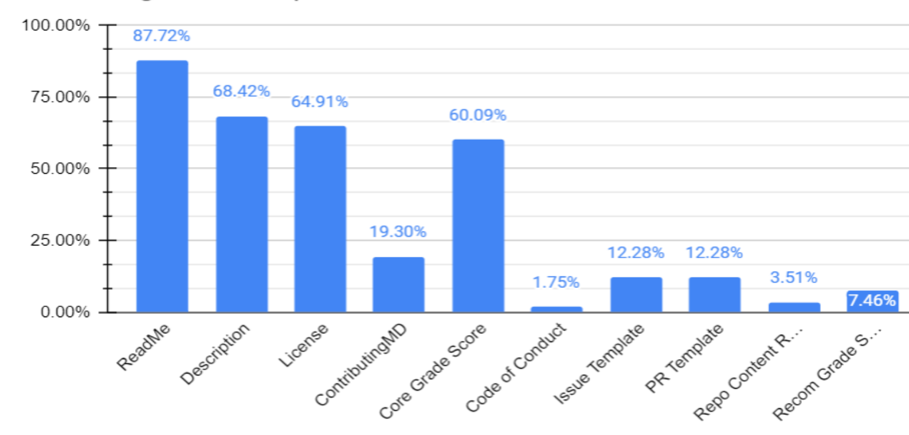

## High Level Summary

* We've been working toward publishing _Cardano Backlog_, currently its in
  review by the IOG communication team.
* We identified a number of libraries which can be published.
* We setup and enhanced [cardano-updates][cardano-updates].

## Detailed description

I am glad to announce that I was given the role of open-source advocate for
cardano project.  In last few weeks we were making steps towards publishing our
backlog.  It's currently under review by the communication team, although most
of the issues are already visible across various repositories.

The open-source initiatives have their own
[project](https://github.com/orgs/input-output-hk/projects/60).  It is set up
to help us track our major open-source activities.  Right now there are two
work streams:

* the work on [_Cardano Engineering Handbook_][ceh];
* libraries to be release on [Hackage][Hackage] or [crates.io][crates.io].

We identifies a number of libraries across all the teams which contribute to
_Cardano_ which we would like publish to publish, see the following
[link][publish-on-hackage].  Arnauld Bailly recently published
[`quickcheck-dynamic`](https://hackage.haskell.org/package/quickcheck-dynamic)
library on Hackage.  The networking team is slowly progressing towards
publishing [io-sim][io-sim] and related packages, checkout the progress
[here](https://github.com/orgs/input-output-hk/projects/19/views/24).

Thanks to Arnaud Bailly our [Cardano Updates][cardano-updates] website has
a new look & feel!  It's using [docusaurus.io][docusaurus].

Christian Taylor carried recently a detailed analysis of our open-source
repositories.  He collected many interesting metrics, which allows us to see
where we need to improve as an open-source project to make the Cardano project
and many smaller related libraries which we maintain be more open and available
for open-source contributors.

The graph below shows which documents the 55 most important Cardano
repositories are missing the most:

You can expect we will improve in these metrics in the coming weeks.

[Hackage]: https://hackage.haskell.org/
[crates.io]: https://crates.io
[publish-on-hackage]: https://github.com/orgs/input-output-hk/projects/60/views/3
[io-sim]: https://github.com/input-output-hk/io-sim
[ceh]: https://input-output-hk.github.io/cardano-engineering-handbook/
[cardano-updates]: https://updates.cardano.intersectmbo.org
[docusaurus]: https://docusaurus.io
