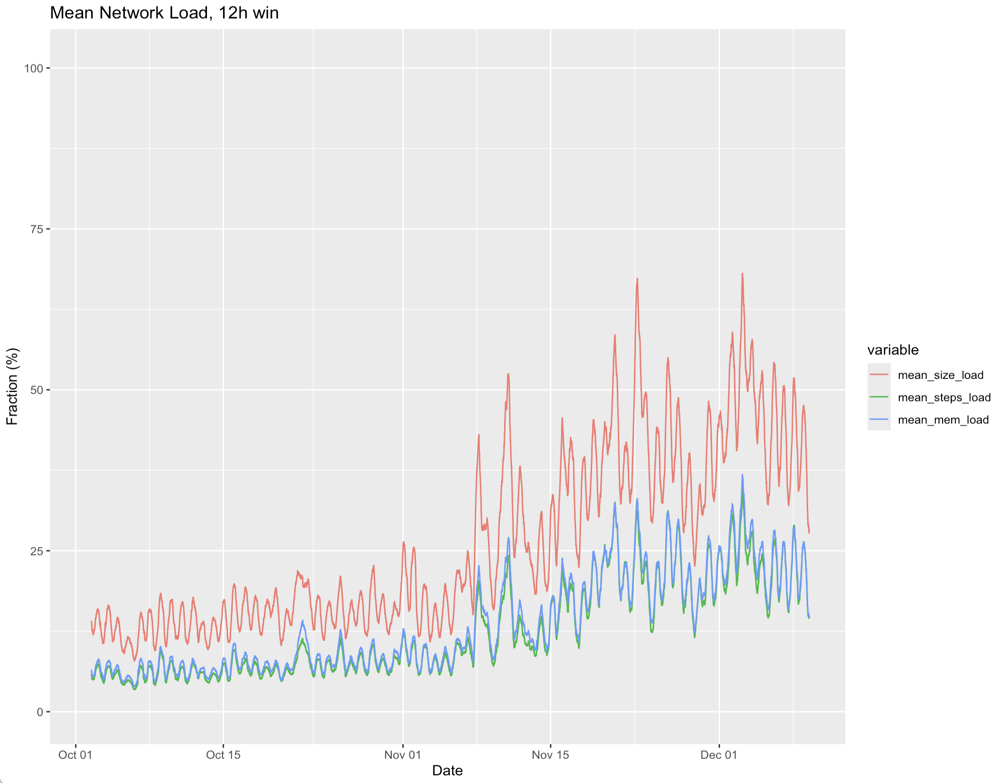

## Overview of [sprint 76][sprint-76]

### Network Load

The Cardano Foundation monitors the network by injecting "canary" transactions,
allowing us to measure the time taken for a transaction to be included in
a block. Approximately four to five of these transactions are submitted every
hour.

Since early November, network load has increased, but most transactions are
still included within the first or second block after submission. Even if the
network is not congested, transactions may not reach the Block Producer
responsible for the next block in time due to network propagation delays.
Therefore, only a transaction that takes three or more blocks to be included
indicates a loaded network.

Since November 1, 2024, we have submitted around 3,700 "canary" transactions,
and only 59 of them took longer than two blocks to be included, meaning 98.4%
of our test transactions were included within the two-block limit. During this
period, the longest observed time to inclusion was five blocks for two
transactions and the maximum wait time is 201 seconds.

Where the y-axis is a fraction of the block size in the respected dimension (e.g.
size, steps, memory).

### Hot Standby Block-Producer Nodes

In the last Network Working Group Meeting (**NWG**) we discussed solutions for
running hot standby block producers using P2P.  

### Short-Term Solution: Local Root Initiator Only Outbound Connections

We agreed to implement initiator-only connections for local roots, which
wouldn't bind to the node address (and thus would be made from an ephemeral
port).  This allows SPOs to have hot standby nodes which are hidden from relays
using a firewall rule, while they still can connect to the relays (so they
receive blocks while the blocks they produce are not sent to the network). See
the [ouroboros-network#5020] issue and associated PRs:

* [ouroboros-network#5021]
* [ouroboros-network#5017]

The latter PR makes P2P node run on systems with multiple network interfaces
or a single interface with multiple IP addresses.

An SPO can control the diffusion mode (initiator only / initiator
and responder) in the topology file.  A draft PR is available in the
[coot/connection-manager-initiator-only-0.13.2.5 ] branch.

In the NWG meeting, it was agreed that once this functionality is implemented, we
can remove NonP2P code from `ouroboros-network` ([ouroboros-network#5007]).

### Long-Term Solution

An agreed long-term solution is to allow to control block propagation of
self-produced blocks through `cardano-cli`.

## Reusable Diffusion

We continued working on making ouroboros-network reusable for both
`cardano-node` and `mithril` (see [CIP#137]).  The PR can be found here:
[ouroboros-network#5016], while a more detailed description of its direction can
be found [here][reusable-diffusion].  During this sprint, we carried out a team-wise PR
review.

## Block Fetch Client For Genesis

A new block-fetch client designed for Genesis was merged, see
[ouroboros-network#4919].  The design of the new block-fetch Gensis logic is
described in [here][block-fetch-genesis].

## KES Agent: Raw Bearer API

We recently merged [ouroboros-network#4395] - a PR which is important for the
KES-agent workstream.

[sprint-76]: https://github.com/orgs/IntersectMBO/projects/5/views/1?filterQuery=sprint%3A%40previous&pane=issue&itemId=47853619&issue=IntersectMBO%7Couroboros-network%7C4244

[block-fetch-genesis]: https://ouroboros-network.cardano.intersectmbo.org/ouroboros-network/Ouroboros-Network-BlockFetch-Decision-Genesis.html
[ouroboros-network#4395]: https://github.com/IntersectMBO/ouroboros-network/pull/4395
[ouroboros-network#4919]: https://github.com/IntersectMBO/ouroboros-network/pull/4919
[ouroboros-network#5007]: https://github.com/IntersectMBO/ouroboros-network/issues/5007
[ouroboros-network#5016]: https://github.com/IntersectMBO/ouroboros-network/issues/5016
[ouroboros-network#5017]: https://github.com/IntersectMBO/ouroboros-network/issues/5017
[ouroboros-network#5020]: https://github.com/IntersectMBO/ouroboros-network/issues/5020
[ouroboros-network#5021]: https://github.com/IntersectMBO/ouroboros-network/issues/5021
[coot/connection-manager-state-0.13.2.5]: https://github.com/IntersectMBO/cardano-node/tree/coot/connection-manager-state-0.13.2.5
[coot/connection-manager-initiator-only-0.13.2.5 ]: https://github.com/IntersectMBO/cardano-node/tree/coot/connection-manager-initiator-only-0.13.2.5 
[reusable-diffusion]: https://github.com/IntersectMBO/ouroboros-network/wiki/Reusable-Diffusion-Investigation
[CIP#137]: https://cips.cardano.org/cip/CIP-0137

