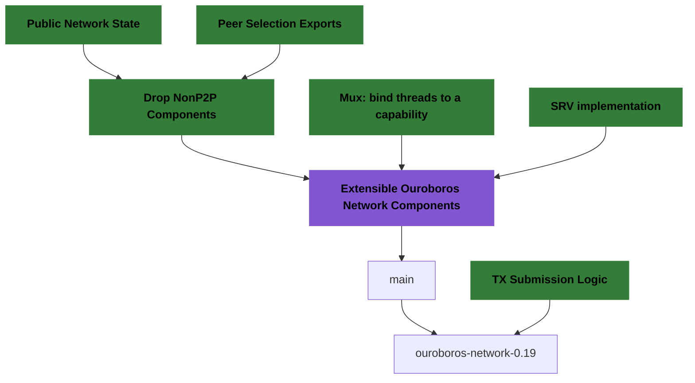

## Overview of [sprint 80][sprint-80] & [sprint 81][sprint-81]

### Current workstream

We decided to hold some PRs in favour of some others to simplify the merging
process.  Here's a dependency graph for PRs on which we're working on.  The
[**Extensible Ouroboros Network Diffusion Stack**][ouroboros-network#5016] PR
was the largest in our queue.

### Fixes which made into the on-going `cardano-node-10.2.1`

* We fixed the peer-sharing application to only use the negotiated
  `peerSharing` flag in the [`NodeToNodeVersionData`]; see
  [ouroboros-network#5061].
* We modified `IOError` exception handling: [ouroboros-network#5076].

Previously, we introduced a new `IOError` handling policy due to a discussion with
an SPO to make some scenarios easier to debug.  After testing it (the changes
never made it into a release), it turned out this could lead to attacks on the
system.  Thus, we advocate for better monitoring of nodes (e.g. if resources
like file descriptors memory are available, the node is making progress)
rather than rely on `cardano-node` to be up and running.

### New mux strategy for starting mini-protocols

[Karl Knutsson][karl] ([CF]) implemented a new strategy for starting
mini-protocols, `StartOnDemandAny`.  A mini-protocol which is using this
strategy will be started as soon as any `StartOnDemand` (or `StartOnDemandAny`)
mini-protocol receives input from the network.  We will use this starting
strategy for the `keep-alive` mini-protocol.

### Local-TX-Monitor protocol changes

A new query was added, which allows the retrieval of all measures/dimensions of the
mempool capacity, e.g. byte-size capacity, ledger's execution units for both
memory and execution steps, and reference
scripts size. See [ouroboros-network#4918].

### Network Specification Updates

We made language improvements in the network specification, see
[ouroboros-network#5044]; and some smaller changes/fixes
[ouroboros-network#5053].

### Other minor changes

* [**Label some threads**][ouroboros-network#5050];
* [**Churn no timeouts test failure**][ouroboros-network#5072];
* [**Added haddocks to MiniProtocol type**][ouroboros-network#5073];

[sprint-80]: https://github.com/orgs/IntersectMBO/projects/5/views/1?filterQuery=sprint%3A%22Sprint+80%22
[sprint-81]: https://github.com/orgs/IntersectMBO/projects/5/views/1?filterQuery=sprint%3A%22Sprint+81%22

[karl]: https://github.com/karknu
[CF]: https://www.cardanofoundation.org/

[`NodeToNodeVersionData`]: https://ouroboros-network.cardano.intersectmbo.org/ouroboros-network-api/Ouroboros-Network-NodeToNode-Version.html#t:NodeToNodeVersionData

[ouroboros-network#4918]: https://github.com/IntersectMBO/ouroboros-network/pull/4918
[ouroboros-network#5007]: https://github.com/IntersectMBO/ouroboros-network/pull/5007
[ouroboros-network#5016]: https://github.com/IntersectMBO/ouroboros-network/pull/5016
[ouroboros-network#5044]: https://github.com/IntersectMBO/ouroboros-network/pull/5044
[ouroboros-network#5046]: https://github.com/IntersectMBO/ouroboros-network/pull/5046
[ouroboros-network#5050]: https://github.com/IntersectMBO/ouroboros-network/pull/5050
[ouroboros-network#5053]: https://github.com/IntersectMBO/ouroboros-network/pull/5053
[ouroboros-network#5061]: https://github.com/IntersectMBO/ouroboros-network/pull/5061
[ouroboros-network#5072]: https://github.com/IntersectMBO/ouroboros-network/pull/5072
[ouroboros-network#5073]: https://github.com/IntersectMBO/ouroboros-network/pull/5073
[ouroboros-network#5076]: https://github.com/IntersectMBO/ouroboros-network/pull/5076
